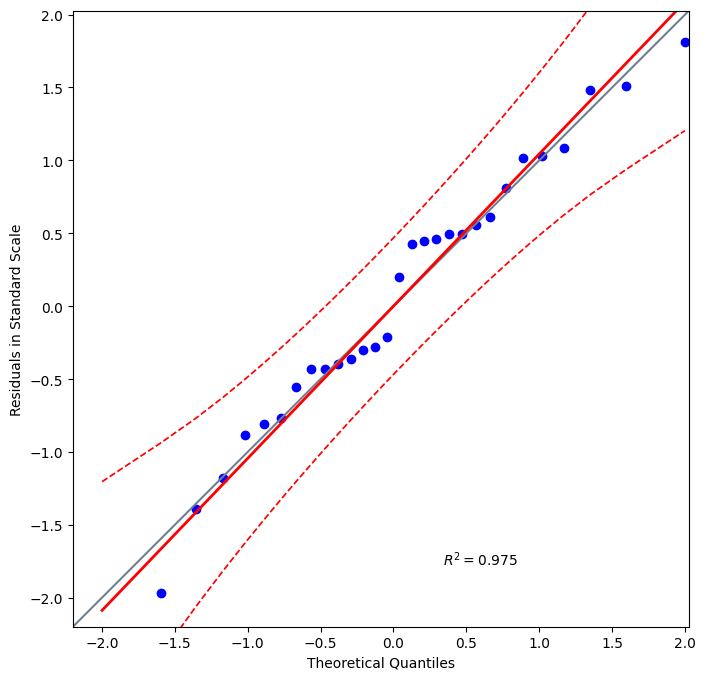
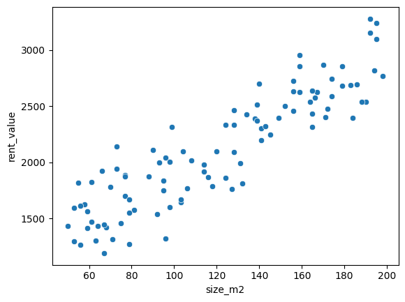
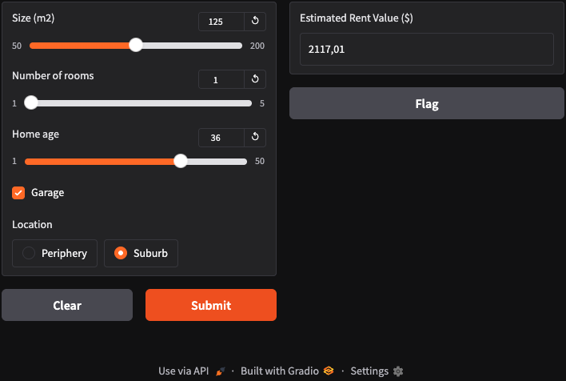

Below is a sample `README.md` that references `app_gradio_rent.ipynb` for running the Gradio interface. It also includes example plots, the Gradio screenshot, and a TypeScript snippet for API integration.

Make sure to replace placeholder image paths (`images/plot_distribution.png`, etc.) with the actual paths in your repo.

---

```markdown
# Rent Value Prediction

This repository contains a machine learning project that estimates the monthly rent for a property based on various features (e.g., size, number of rooms, location, etc.). It includes:
- A Jupyter Notebook (`rent_prediction.ipynb`) for data exploration, preprocessing, and model training.
- A Gradio-based web interface notebook (`app_gradio_rent.ipynb`) for quickly testing rent predictions without writing any code.
- Example plots and visualizations from exploratory data analysis.

---

## Table of Contents

1. [Project Overview](#project-overview)  
2. [Installation](#installation)  
3. [Usage](#usage)  
4. [Plots and Screenshots](#plots-and-screenshots)  
5. [API Integration Example](#api-integration-example)  
6. [Contributing](#contributing)  
7. [License](#license)

---

## Project Overview

**Goal**: Predict a property’s monthly rent value given:
- **Size (m²)**
- **Number of rooms**
- **Home age**
- **Garage** (boolean)
- **Location** (categorical: periphery vs. suburb)
  
The underlying model uses techniques such as regression or other supervised learning methods.  

**Key Files**:
- `rent_prediction.ipynb` – Data loading, cleaning, feature engineering, model training, and evaluation.
- `app_gradio_rent.ipynb` – Gradio interface to input property features and view the predicted rent.
- `requirements.txt` – Python dependencies.

---

## Installation

1. **Clone the repository**:
   ```bash
   git clone https://github.com/your-username/rent-value-prediction.git
   cd rent-value-prediction
   ```

2. **Create and activate a virtual environment** (optional, but recommended):
   ```bash
   python -m venv venv
   source venv/bin/activate   # On macOS/Linux
   .\venv\Scripts\activate    # On Windows
   ```

3. **Install the required dependencies**:
   ```bash
   pip install -r requirements.txt
   ```

---

## Usage

### 1. Run the Exploratory Notebook
Open `rent_prediction.ipynb` in Jupyter (or any compatible environment) to see:
- Data exploration
- Plot generation
- Model training and evaluation

```bash
jupyter notebook rent_prediction.ipynb
```

### 2. Launch the Gradio Interface
Open `app_gradio_rent.ipynb` in Jupyter (or any compatible environment) and run all cells.  
Once the Gradio app is initialized, it will provide a local URL (often `http://127.0.0.1:7860`) you can open in your browser to interact with the UI.

---

## Plots and Screenshots

Below are some preview images showcasing the project’s outputs and interface.

### Exploratory Data Analysis Plots

**Distribution of Rental Prices**  


**Size vs. Rent**  


*(Replace these paths with the actual image paths in your repo.)*

### Gradio Interface

Below is a screenshot of the Gradio web app, where users can select property features and get an instant rent estimate:



---

## API Integration Example

If you’d like to integrate this model into a TypeScript/JavaScript front-end, you can expose a Gradio or FastAPI endpoint (depending on your setup) and call it. Below is an example TypeScript snippet for calling a REST endpoint (replace the URL and payload as needed).

```ts
// rentApi.ts
export async function getRentPrediction(
  size: number,
  rooms: number,
  age: number,
  garage: boolean,
  location: string
): Promise<number> {
  const response = await fetch("http://localhost:7860/predict", {
    method: "POST",
    headers: {
      "Content-Type": "application/json",
    },
    body: JSON.stringify({
      size,
      rooms,
      age,
      garage,
      location,
    }),
  });

  if (!response.ok) {
    throw new Error(`API request failed with status ${response.status}`);
  }

  const data = await response.json();
  return data.predictedRent; // Adjust to match the actual JSON structure
}
```

In your front-end, you could call this function:
```ts
import { getRentPrediction } from "./rentApi";

async function estimateRent() {
  try {
    const prediction = await getRentPrediction(125, 1, 36, true, "Suburb");
    console.log("Estimated rent: ", prediction);
  } catch (error) {
    console.error("Error while fetching rent prediction:", error);
  }
}
```

---

## Contributing

1. Fork the repository.  
2. Create a new branch (`git checkout -b feature/my-feature`).  
3. Commit your changes (`git commit -m 'Add new feature'`).  
4. Push to the branch (`git push origin feature/my-feature`).  
5. Open a Pull Request.  

---

## License

This project is licensed under the [MIT License](LICENSE). You are free to use, modify, and distribute this software as long as the original license is retained.

---

## Contact

For any questions or feedback, feel free to open an issue or reach out to the maintainers.

---

**Enjoy predicting your property’s rent value!**